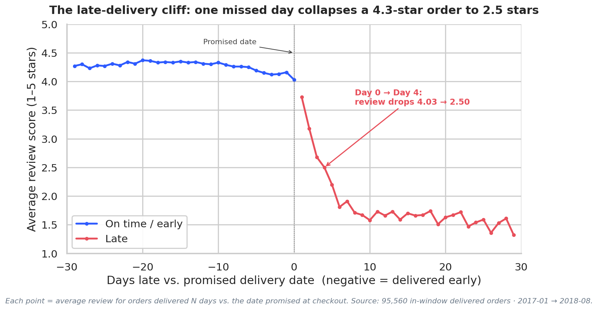
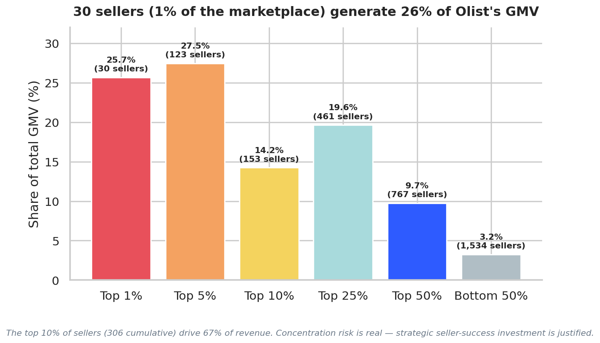
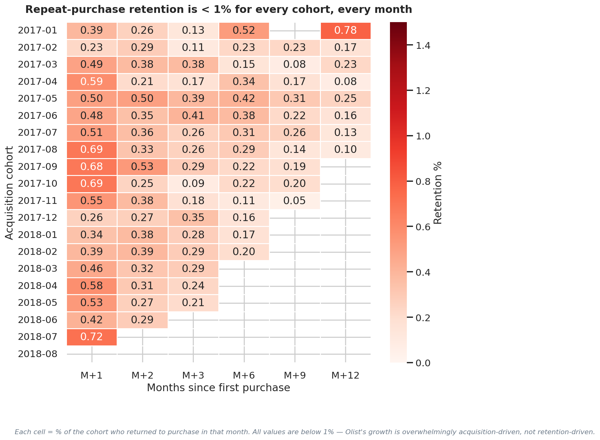

# Olist Brazilian E-Commerce — Marketplace Analysis

> A senior-analyst breakdown of 99,441 orders, 96,096 unique customers, 3,095 sellers, and R$ 13.6M of GMV transacted on Olist between January 2017 and August 2018.
>
> Stack: PostgreSQL 16 · pandas · matplotlib · seaborn · Streamlit.

---

## TL;DR — three findings that change the conversation

### 1. The late-delivery cliff costs Olist 1.7 stars per missed promise.



On-time orders average **4.29 ★**. Late orders average **2.57 ★**. The drop happens within a single business day of the promised date and stays there: by day 7 late, average review is **1.91 ★** and 63% of customers leave 1-star reviews. **On-time delivery rate is the single strongest driver of review score in this dataset** — stronger than category, seller, price, or installments. (Source: 95,560 in-window delivered orders, `sql/04_delivery_vs_satisfaction.sql`.)

### 2. 30 sellers (the top 1%) generate 26% of platform GMV.



The top 10% of sellers (306 cumulative) drive **67% of GMV**; the bottom 50% (1,534 sellers) generate just **3.2%**. Olist's growth is deeply concentrated — and a focused seller-success programme protecting the top 100 accounts has higher leverage than acquiring 1,000 long-tail sellers. (Source: `sql/06_seller_performance.sql`.)

### 3. Repeat purchase is < 1% in every cohort, every month.



Across 20 monthly acquisition cohorts, M+1 retention peaks at **0.72%** (July 2018) and M+12 peaks at **0.78%**. Olist's growth is overwhelmingly acquisition-driven. The biggest reactivation prize identified by this analysis is the **High-Value Lost** segment — **11,950 customers**, average lifetime spend R$ 272, average review score 4.58 ★ — who simply have not come back. (Source: `sql/08_cohort_retention.sql`, `sql/05_rfm_segmentation.sql`.)

---

## What's in this repository

```
.
├── sql/
│   ├── 01_schema_setup.sql          DDL for the 9 staging tables
│   ├── 02_data_cleaning.sql         6 analysis-ready views, with explicit cleaning decisions
│   ├── 03_revenue_by_category.sql   Category economics + Pareto curve
│   ├── 04_delivery_vs_satisfaction.sql  The cliff, by delay-day bucket and by state
│   ├── 05_rfm_segmentation.sql      Modified RFM (frequency degenerate → has_repeated)
│   ├── 06_seller_performance.sql    Concentration, top sellers, risk-seller flagging
│   ├── 07_monthly_revenue_trend.sql Monthly GMV / AOV / freight share
│   ├── 08_cohort_retention.sql      Long + wide cohort retention tables
│   ├── load_data.sql                idempotent \copy loader for all 9 CSVs
│   ├── run_analyses.sh              one-shot runner → CSV + markdown outputs
│   └── outputs/                     22 generated artifacts (CSV + .md previews)
├── visuals/
│   ├── build_visuals.py             chart factory
│   └── 01–08_*.png                  the 8 charts above
├── notebooks/
│   └── eda_analysis.ipynb           narrative EDA walkthrough
├── dashboard/
│   └── dashboard.py                 Streamlit app (multi-page)
├── report/
│   └── business_summary.md          stakeholder-facing narrative
├── data/
│   ├── raw/                         9 source CSVs (Kaggle)
│   └── cleaned/
├── requirements.txt
├── CLAUDE.md
└── README.md
```

---

## Reproducing the analysis

```bash
# 1. Install Postgres (one-time) and create the database
brew install postgresql@16 && brew services start postgresql@16
createdb olist

# 2. Build schema + load CSVs (~30 seconds; geolocation is the slow one)
psql -d olist -f sql/01_schema_setup.sql
psql -d olist -f sql/load_data.sql

# 3. Build cleaned views
psql -d olist -f sql/02_data_cleaning.sql

# 4. Run all 6 analyses → CSV + markdown outputs
bash sql/run_analyses.sh

# 5. Render charts
pip install -r requirements.txt
python visuals/build_visuals.py

# 6. Optional: launch interactive dashboard
streamlit run dashboard/dashboard.py
```

Total wall-clock to reproduce from raw CSVs: **~2 minutes**.

---

## The 6 analyses, briefly

| # | File | Question | Headline finding |
|---|---|---|---|
| 1 | `07_monthly_revenue_trend.sql` | How has Olist's marketplace grown? | R$ 0.12M (Jan-2017) → R$ 1.0M peak (Nov-2017 Black Friday) → 6-month plateau at R$ 0.85–1.0M from Mar-2018 onward |
| 2 | `03_revenue_by_category.sql`   | Which categories drive GMV? | Top 3 categories — Health & Beauty, Watches & Gifts, Bed Bath & Table — generate **R$ 3.5M (26% of GMV)** between them |
| 3 | `04_delivery_vs_satisfaction.sql` | How does delivery performance affect reviews? | A single day late → review collapses from 4.03 ★ to 3.73 ★. By day 7 late → 1.91 ★ |
| 4 | `05_rfm_segmentation.sql`      | Who are Olist's customer segments? | Champions = **985 customers (1.0% of base, 2.4% of GMV)**. High-Value Lost = **11,950 customers, R$ 3.25M of past spend** that has gone dark |
| 5 | `06_seller_performance.sql`    | How concentrated is the seller base? | Top 1% (30 sellers) = 26% of GMV. 47 top-quartile sellers carry **risk flags** (review < 4.0 or on-time < 85%) |
| 6 | `08_cohort_retention.sql`      | Is acquisition translating to retention? | M+1 retention < 1% in every cohort. The marketplace is a **single-purchase funnel**, not a relationship business |

Each analysis writes both a CSV (for downstream Python / BI tooling) and a markdown preview to `sql/outputs/`.

---

## Data quality notes

These are surfaced rather than swept under the rug — a real analyst flags them:

| Issue | Impact | Handling |
|---|---|---|
| Date range edges (Sept 2016: 4 orders; Sept-Oct 2018: 20 orders) | Would crush any time-series chart | `in_analysis_window` flag in `v_orders_clean`; window = 2017-01 → 2018-08 |
| 610 products have NULL `product_category_name` | ~R$140K of GMV would silently disappear | Bucketed as `'unknown'` in `v_products_clean` |
| 2 of 73 categories untranslated (`pc_gamer`, `portateis_cozinha_…`) | Missing rows in English reports | Manual `INSERT ... ON CONFLICT` patch in `02_data_cleaning.sql` |
| 2,965 orders with status ≠ 'delivered' | Distort delivery-time analysis | Filtered explicitly per-analysis; counted in the cancellation metrics |
| `customer_id` is NOT unique per person | Junior-analyst trap → 0% repeat rate | All retention work uses `customer_unique_id` |
| `review_id` not unique in source (~800 collisions) | Would break a naive PK | No PK on `order_reviews`; latest-by-`order_id` selected in `v_order_satisfaction` |
| Geolocation has ~1M rows for ~19K zips | Cartesian-explosion risk on join | Centroid aggregation in `v_geolocation_clean` |
| 8 'delivered' orders have NULL delivered date | Maps to NULL `delivered_on_time` | Filtered explicitly in delivery analyses |

---

## What I'd build next (and why I didn't)

| Idea | Why interesting | Why not in v1 |
|---|---|---|
| Cross-state freight-and-time gradient (haversine on geolocation) | Quantifies the operational cost of selling out of São Paulo to the Amazon basin | Needs PostGIS or a haversine UDF; out of scope for a focused first deliverable |
| Payment-installment behaviour by AOV / category | Brazil's `parcelamento` culture is a free-credit demand lever | Niche to LATAM recruiters; covered briefly in EDA notebook |
| Seller cohort retention (do new sellers stay active?) | Mirror of customer retention, but for the supply side | Would double the cohort surface area; saved for v2 |
| NLP on the 41,000 review comments | Themes inside 1-star reviews — is it always delivery? | Adds an ML dependency surface; the structured signal is already strong |

---

## Acknowledgements

Source data: [Brazilian E-Commerce Public Dataset by Olist](https://www.kaggle.com/datasets/olistbr/brazilian-ecommerce) on Kaggle.

The data covers a real Brazilian marketplace from Sept 2016 – Oct 2018. All analyses in this repository were produced from the raw CSVs without external enrichment.
